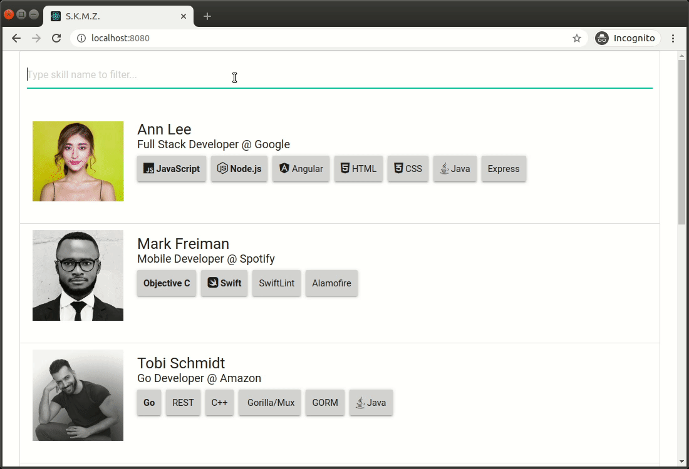

SKMZ [](https://travis-ci.com/Shpota/skmz) [](https://codecov.io/gh/Shpota/skmz)
====

A web application that allows to query programmers
with their skills via a **GraphQL** API. The
application is implemented with **Go** and 
**[gqlgen](https://github.com/99designs/gqlgen)**
on the backend side and **React** on the front end
side. **MongoDB** is used as a database.




## System requirements 
You need to have [Docker](https://www.docker.com) and
[Docker Compose](https://docs.docker.com/compose/)
installed. No additional tools required.

## How to build and run
Perform 
```sh
docker-compose up
```
Access the application via http://localhost:8080.
Access the GraphQL Playground using 
http://localhost:8080/playground.

## How to customize
The database starts with a preloaded set of data which
can be customized in 
[the mongo.init file](server/db/mongo.init).  

Here is an example of a GraphQL query which can be
run in the Playground:
```graphql
query {
  programmers(skill: "go") { 
    name, 
    picture, 
    title,
    company, 
    skills {
      name,
      icon,
      importance
    }
  }
}
```
